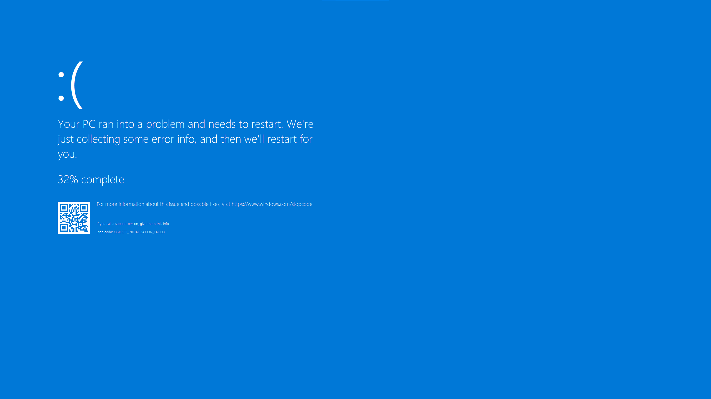
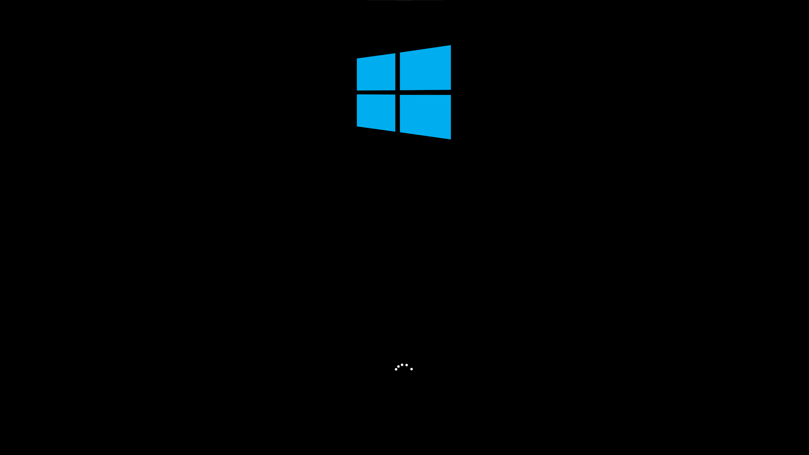
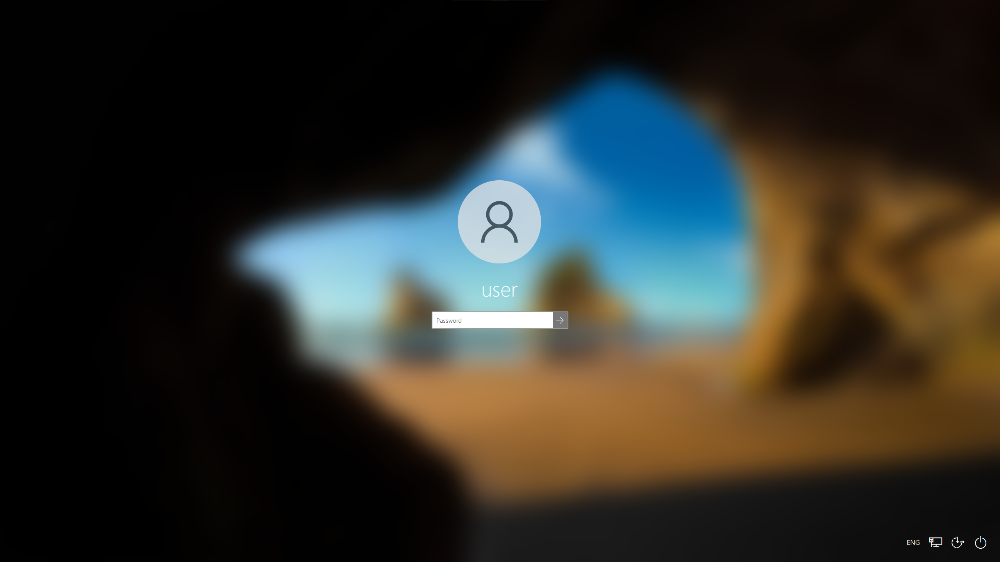

# winfake
Fake Windows login screen including a blue screen simulation.

## Preamble

### Disclaimer
Winfake is for educational purposes only, intended to show security flaws that are coming with Windows. This tool comes without any warranty.

**You may not use this software for illegal or unethical purposes. This includes activities which give rise to criminal or civil liability.**

**Under no event shall the licensor be responsible for any activities, or misdeeds, by the licensee.**

## Content
1. [Features](#1-features)
2. [Appearance](#2-appearance)
3. [How-to](#3-how-to)
4. [Outlook](#4-outlook)
5. [See also](#5-see-also)

## 1. Features
All features are imitated from the original ones included in Windows 10.

1. **Blue Screen:**
    - simulated progress
    - QR code to support website
    - random error code
2. **Loading Screen:**
    - loading animation
3. **Lock Screen:**
    - Windows background
    - date and time
4. **Login Screen:**
    - blurred Windows background
    - Windows profile image
    - username displayed
    - multiple symbols in the lower right corner

The following non-visible features are also implemented:
- **Key Blocker:**
    - blocking all keys before login screen is visible
    - blocking `LWin` and `LMenu` all time
    - `Ctrl` will trigger the original lock screen (so that the user can not trigger `Ctrl`+`Alt`+`Del` and open the task manager)

## 2. Appearance
 Fig. 2.1: Blue Screen

 Fig. 2.2: Loading Screen

 Fig. 2.3: Lock Screen

 Fig. 2.4: Login Screen

## 3. How-to

## 4. Outlook

## 5. See also
- **[SharpLocker](https://github.com/Pickfordmatt/SharpLocker) by ([@Pickfordmatt](https://github.com/Pickfordmatt)) and its fork [SharpLocker](https://github.com/3top1a/SharpLocker) by ([@3top1a](https://github.com/3top1a))**  
SharpLocker helps get current user credentials by popping a fake Windows lock screen, all output is sent to Console which works perfect for Cobalt Strike. It is written in C# to allow for direct execution via memory injection using techniques such as execute-assembly found in Cobalt Strike or others, this method prevents the executable from ever touching disk. It is NOT intended to be compilled and run locally on a device.

- **Videos by [@Seytonic](https://www.youtube.com/channel/UCW6xlqxSY3gGur4PkGPEUeA) on Youtube**  
[BadUSB: Windows Fake Lock Screen Pwn](https://www.youtube.com/watch?v=JYi_H9n5xjw)  
[UPDATE: Windows Fake Lock Screen Trick](https://www.youtube.com/watch?v=k5zAneakv3w)
